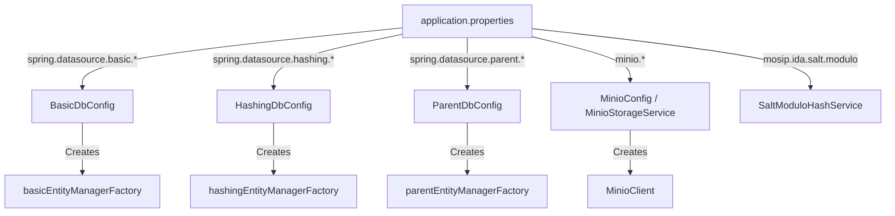

# Project Structure & Functionality Documentation

This document provides a comprehensive overview of the **MOSIP UIN Registration & Voluntary Deletion Portal** codebase. It details the hierarchical directory structure, describes the purpose and functionality of every source file, lists all configuration parameters, and maps where and how configurations impact the system.

---

## 📂 File Structure Overview

```
Mosip-uin-deletion/
├── .mvn/                                      # Maven wrapper configuration directory
│   └── wrapper/                               # Contains maven-wrapper.properties and jar
├── src/
│   ├── main/
│   │   ├── java/                              # Application source code
│   │   │   └── com/example/mosip/             # Root package for the project
│   │   │       ├── config/                    # Configuration classes for databases and MinIO
│   │   │       ├── controller/                # Spring MVC Controllers for Thymeleaf views
│   │   │       │   └── api/                   # REST API Controllers (for endpoints, images & bulk operations)
│   │   │       ├── dto/                       # Data Transfer Objects
│   │   │       ├── entity/                    # JPA Entities mapped to PostgreSQL tables
│   │   │       │   ├── basic/                 # Entities for Basic details database
│   │   │       │   ├── hashing/               # Entities for Hashing database
│   │   │       │   └── parent/                # Entities for Parent details database
│   │   │       ├── enums/                     # Enumerations for system types and folder boundaries
│   │   │       ├── repository/                # Spring Data JPA Repository interfaces
│   │   │       │   ├── basic/                 # Repositories for Basic details database
│   │   │       │   ├── hashing/               # Repositories for Hashing database
│   │   │       │   └── parent/                # Repositories for Parent details database
│   │   │       ├── service/                   # Core business logic services
│   │   │       └── MosipUinDeletionApplication.java # Spring Boot main entrypoint
│   │   └── resources/                         # Application resources
│   │       ├── static/                        # Static assets
│   │       │   └── css/                       # Stylesheets (styles.css)
│   │       ├── templates/                     # Thymeleaf HTML view templates
│   │       └── application.properties         # Central application configurations
│   └── test/
│       └── java/                              # Test source code
│           └── com/example/mosip/             # Test classes
│               └── MosipUinDeletionApplicationTests.java # Context loading tests
├── pom.xml                                    # Maven project definition & dependencies configuration
├── mvnw                                       # Maven Wrapper execution script (Unix)
├── mvnw.cmd                                   # Maven Wrapper execution script (Windows)
├── .gitignore                                 # Files and folders to ignore in Git
├── .gitattributes                             # Git line endings configuration
└── README.md                                  # Project overview and run instructions
```

### Purpose of Each Directory

* **`src/main/java/com/example/mosip/config/`**: Sets up Spring configurations, specifically managing the configuration of the multi-database architecture (three distinct PostgreSQL datasources) and initializing the MinIO S3-compatible client.
* **`src/main/java/com/example/mosip/controller/`**: Orchestrates web requests. The base folder contains controllers that serve Thymeleaf templates for forms, multi-step deletion, success screens, and audit logs.
* **`src/main/java/com/example/mosip/controller/api/`**: Exposes REST endpoints to allow integration, bulk onboarding, programmatic deletion of residents' data, and dedicated image deletion operations (`/api/images`).
* **`src/main/java/com/example/mosip/dto/`**: Holds DTOs (Data Transfer Objects) that bind incoming registration web form submissions containing multi-image file data and text fields.
* **`src/main/java/com/example/mosip/entity/`**: Segmented by database concern (basic, hashing, parent). Holds entities annotated with JPA annotations mapping to tables across the PostgreSQL instances.
* **`src/main/java/com/example/mosip/enums/`**: Defines system enums, specifically `ImageType` mapping image categories to folder structures (`/profile-pictures/`, `/aadhar-cards/`, `/documents/`) and file size boundaries.
* **`src/main/java/com/example/mosip/repository/`**: Holds JPA repository interfaces facilitating CRUD operations. Organized into subpackages matching the three-database boundary structure.
* **`src/main/java/com/example/mosip/service/`**: Houses utility and storage services, specifically for executing MOSIP-style salt-modulo hashing and managing multi-image storage (uploads, validation, presigned URL generation, and cascading file purges) in MinIO.
* **`src/main/resources/static/`**: Houses public files served by the embedded Tomcat server (like CSS for consistent UI styling).
* **`src/main/resources/templates/`**: Holds HTML templates processed by Thymeleaf to dynamically compile responsive light-themed user interfaces.
* **`src/test/java/`**: Houses testing suites to verify context loading and project components.

---

## 🧩 File Functionality

Below is a detailed guide on what each file does and the role of each component in the application.

### Build and Root Config Files
* **[pom.xml](file:///c:/Users/Harsh/Documents/GitHub/Mosip-uin-deletion/pom.xml)**: Defines Maven dependencies including Spring Boot starters (Thymeleaf, Web, Data JPA), PostgreSQL driver, devtools, and the MinIO client SDK (`io.minio:minio`).
* **[MosipUinDeletionApplication.java](file:///c:/Users/Harsh/Documents/GitHub/Mosip-uin-deletion/src/main/java/com/example/mosip/MosipUinDeletionApplication.java)**: The main entrypoint of the application. Annotated with `@SpringBootApplication` to boot up the Spring context, auto-configuration, and start the Tomcat web server.

### Configuration Classes (`/config`)
* **[BasicDbConfig.java](file:///c:/Users/Harsh/Documents/GitHub/Mosip-uin-deletion/src/main/java/com/example/mosip/config/BasicDbConfig.java)**:
  * Manages Database 1 (Demographics & Audit details).
  * Defines the primary `DataSource` bean (`basicDataSource`) bound to prefix `spring.datasource.basic`.
  * Configures the Primary Entity Manager (`basicEntityManagerFactory`) and Transaction Manager (`basicTransactionManager`).
  * Scans package `com.example.mosip.repository.basic` for repository classes and `com.example.mosip.entity.basic` for entities.
* **[HashingDbConfig.java](file:///c:/Users/Harsh/Documents/GitHub/Mosip-uin-deletion/src/main/java/com/example/mosip/config/HashingDbConfig.java)**:
  * Manages Database 2 (UIN cryptographic hashes & salt values).
  * Defines `hashingDataSource` bound to prefix `spring.datasource.hashing`.
  * Configures the JPA Entity Manager (`hashingEntityManagerFactory`) and Transaction Manager (`hashingTransactionManager`).
  * Scans package `com.example.mosip.repository.hashing` for repositories and `com.example.mosip.entity.hashing` for entities.
* **[ParentDbConfig.java](file:///c:/Users/Harsh/Documents/GitHub/Mosip-uin-deletion/src/main/java/com/example/mosip/config/ParentDbConfig.java)**:
  * Manages Database 3 (Father/Mother details).
  * Defines `parentDataSource` bound to prefix `spring.datasource.parent`.
  * Configures the Entity Manager (`parentEntityManagerFactory`) and Transaction Manager (`parentTransactionManager`).
  * Scans package `com.example.mosip.repository.parent` for repositories and `com.example.mosip.entity.parent` for entities.
* **[MinioConfig.java](file:///c:/Users/Harsh/Documents/GitHub/Mosip-uin-deletion/src/main/java/com/example/mosip/config/MinioConfig.java)**:
  * Reads MinIO endpoint credentials from properties.
  * Registers a singleton `MinioClient` bean to connect to the local/remote S3 object storage server.

### Enums (`/enums`)
* **[ImageType.java](file:///c:/Users/Harsh/Documents/GitHub/Mosip-uin-deletion/src/main/java/com/example/mosip/enums/ImageType.java)**:
  * Defines supported image categories: `PROFILE_PICTURE`, `AADHAR_CARD`, and `DOCUMENT`.
  * Maps each category to its folder prefix (`profile-pictures/`, `aadhar-cards/`, `documents/`) and default file size limit (5MB/10MB).
  * Includes helper method `fromString(String text)` for case-insensitive URL parameter parsing.

### Services (`/service`)
* **[SaltModuloHashService.java](file:///c:/Users/Harsh/Documents/GitHub/Mosip-uin-deletion/src/main/java/com/example/mosip/service/SaltModuloHashService.java)**:
  * Implements MOSIP-style deterministic salt-modulo hashing.
  * Seeds 1000 random salt buckets into Database 2 (`uin_hash_salt` table) on startup if not already seeded.
  * Computes deterministic cryptographic hashes: `SHA-256(id + salt[id mod modulo])` in lowercase hex format. Numeric identifiers parse as numbers; non-numeric values use their `hashCode()`.
* **[MinioStorageService.java](file:///c:/Users/Harsh/Documents/GitHub/Mosip-uin-deletion/src/main/java/com/example/mosip/service/MinioStorageService.java)**:
  * Manages MinIO operations for multiple image types.
  * Automatically creates the target bucket (`userprofilepic`) on startup if it is missing.
  * Validates file size limits per `ImageType` and checks allowed file format extensions (JPG, PNG, WEBP, PDF).
  * Uploads images into organized folder structures: `profile-pictures/{userId}-{UUID}.ext`, `aadhar-cards/...`, `documents/...`.
  * Generates temporary presigned URLs (`expiry=604800s`) for secure display.
  * Implements `deleteImage(userId, imageType)`, `deleteImageByObjectKey(objectKey)`, and `deleteAllUserImages(userId)`, which purges files across all folders and returns a `List<String>` of deleted MinIO object paths for audit logging.

### Controllers (`/controller`)
* **[RegistrationController.java](file:///c:/Users/Harsh/Documents/GitHub/Mosip-uin-deletion/src/main/java/com/example/mosip/controller/RegistrationController.java)**:
  * Renders HTML views for the home screen (`/`) and multi-image registration form (`/register`).
  * Processes registrations: generates random unique User IDs (`USR-XXXXXXXX`) and 10-digit UINs.
  * Computes salt-modulo hashes for UIN/User ID.
  * Uploads Profile Photos, Aadhar Cards, and Identity Documents to their respective MinIO folders (`/profile-pictures/`, `/aadhar-cards/`, `/documents/`).
  * Persists demographic records (Database 1), hashes (Database 2), parent details (Database 3), and creates a footprint track record in `UserDataLocation` registry.
* **[DeletionController.java](file:///c:/Users/Harsh/Documents/GitHub/Mosip-uin-deletion/src/main/java/com/example/mosip/controller/DeletionController.java)**:
  * Controls the interactive, multi-step voluntary deletion flow.
  * **`/delete`**: Validates UIN presence and format.
  * **`/delete/send-otp`**: Verifies UIN hash existence in Hashing DB before triggering OTP page.
  * **`/delete/verify-otp`**: Verifies demo OTP (`00000`). Fetches all user details and presigned URLs for preview before deletion.
  * **`/delete/confirm`**: Executes sequential deletion:
    1. Demographics (`UserBasicDetails` in Database 1)
    2. Parent details (`UserParentDetails` in Database 3)
    3. MinIO Multi-Image Store (`MinioStorageService.deleteAllUserImages`)
    4. Cryptographic UIN hash (`UserUinHash` in Database 2)
  * Writes execution outcomes, database names, and exact deleted MinIO object filepaths to the `DeletionAudit` table (`audit.detail`). Removes `UserDataLocation` record on full success.
  * **`/audit-logs`**: Queries `DeletionAudit` table, displays logs, calculates dashboard statistics (success/partial/failed ratios), and supports searching audits by User ID.
* **[api/RegistrationApiController.java](file:///c:/Users/Harsh/Documents/GitHub/Mosip-uin-deletion/src/main/java/com/example/mosip/controller/api/RegistrationApiController.java)**:
  * Exposes programmatic HTTP endpoints:
    * `POST /api/register` - Creates a single resident profile.
    * `POST /api/register/bulk` - Processes an array of resident profiles.
  * Contains `saveParentDetails` acting as the single owner of Parent Details database writes.
* **[api/DeletionApiController.java](file:///c:/Users/Harsh/Documents/GitHub/Mosip-uin-deletion/src/main/java/com/example/mosip/controller/api/DeletionApiController.java)**:
  * Exposes programmatic HTTP endpoint `DELETE /api/user/{userId}`.
  * Purges demographic details (Database 1), cryptographic hashes (Database 2), parent details (Database 3), and performs a cascading purge of all MinIO files across all folders, returning deleted object filepaths in the API response.
* **[api/ImageDeletionApiController.java](file:///c:/Users/Harsh/Documents/GitHub/Mosip-uin-deletion/src/main/java/com/example/mosip/controller/api/ImageDeletionApiController.java)**:
  * Dedicated REST API controller for image management under `/api/images`:
    * `DELETE /api/images/user/{userId}?type={IMAGE_TYPE}` - Deletes specific or all images for a user.
    * `DELETE /api/images/object?objectKey={objectKey}` - Deletes a specific image by MinIO object key.
    * `POST /api/images/batch-delete` - Batch deletes multiple user IDs or object keys.
  * Enforces header-based permission checks (`X-User-Role: ADMIN` or `X-User-Id` match), returning `403 FORBIDDEN` for unauthorized calls.

### Data Entities (`/entity`)
* **[entity/basic/UserBasicDetails.java](file:///c:/Users/Harsh/Documents/GitHub/Mosip-uin-deletion/src/main/java/com/example/mosip/entity/basic/UserBasicDetails.java)**: Represents demographic data (`user_id`, `name`, `phone`) stored in Database 1.
* **[entity/basic/UserDataLocation.java](file:///c:/Users/Harsh/Documents/GitHub/Mosip-uin-deletion/src/main/java/com/example/mosip/entity/basic/UserDataLocation.java)**: Records which data stores (Basic DB, Parent DB, Hashing DB, MinIO) contain data for a User ID. Stored in Database 1.
* **[entity/basic/DeletionAudit.java](file:///c:/Users/Harsh/Documents/GitHub/Mosip-uin-deletion/src/main/java/com/example/mosip/entity/basic/DeletionAudit.java)**: Stores audit rows tracking deletion executions. Records detailed status (`PURGED`, `NOT_FOUND`, `NOT_EXPECTED`, `FAILED`) for each storage layer and captures deleted MinIO file paths in the `detail` column. Stored in Database 1.
* **[entity/hashing/UserUinHash.java](file:///c:/Users/Harsh/Documents/GitHub/Mosip-uin-deletion/src/main/java/com/example/mosip/entity/hashing/UserUinHash.java)**: Stores mapping of User ID to cryptographic hash keys (`individual_id_hash`, `uin_salted_hash`) in Database 2.
* **[entity/hashing/UinHashSalt.java](file:///c:/Users/Harsh/Documents/GitHub/Mosip-uin-deletion/src/main/java/com/example/mosip/entity/hashing/UinHashSalt.java)**: Represents salt buckets (`id` 0 to N-1, `salt` Base64 string) stored in Database 2.
* **[entity/parent/UserParentDetails.java](file:///c:/Users/Harsh/Documents/GitHub/Mosip-uin-deletion/src/main/java/com/example/mosip/entity/parent/UserParentDetails.java)**: Represents family details (`user_id`, `father_name`, `mother_name`) stored in Database 3.

### Data Repositories (`/repository`)
* **[repository/basic/UserBasicDetailsRepository.java](file:///c:/Users/Harsh/Documents/GitHub/Mosip-uin-deletion/src/main/java/com/example/mosip/repository/basic/UserBasicDetailsRepository.java)**: Accesses demographic tables.
* **[repository/basic/UserDataLocationRepository.java](file:///c:/Users/Harsh/Documents/GitHub/Mosip-uin-deletion/src/main/java/com/example/mosip/repository/basic/UserDataLocationRepository.java)**: Accesses and queries the data location registry.
* **[repository/basic/DeletionAuditRepository.java](file:///c:/Users/Harsh/Documents/GitHub/Mosip-uin-deletion/src/main/java/com/example/mosip/repository/basic/DeletionAuditRepository.java)**: Accesses deletion audits, sorting them chronologically.
* **[repository/hashing/UserUinHashRepository.java](file:///c:/Users/Harsh/Documents/GitHub/Mosip-uin-deletion/src/main/java/com/example/mosip/repository/hashing/UserUinHashRepository.java)**: Checks existence and queries hash matches.
* **[repository/hashing/UinHashSaltRepository.java](file:///c:/Users/Harsh/Documents/GitHub/Mosip-uin-deletion/src/main/java/com/example/mosip/repository/hashing/UinHashSaltRepository.java)**: Performs reads/writes on salt buckets.
* **[repository/parent/UserParentDetailsRepository.java](file:///c:/Users/Harsh/Documents/GitHub/Mosip-uin-deletion/src/main/java/com/example/mosip/repository/parent/UserParentDetailsRepository.java)**: Accesses parent/family details.

### DTOs (`/dto`)
* **[UserRegistrationDto.java](file:///c:/Users/Harsh/Documents/GitHub/Mosip-uin-deletion/src/main/java/com/example/mosip/dto/UserRegistrationDto.java)**: Holds fields entered on the `/register` web form, handling uploaded multipart file fields (`profileImage`, `aadharCardImage`, `documentImage`) alongside demographic text fields.

### View Templates (`/resources/templates`)
* **[home.html](file:///c:/Users/Harsh/Documents/GitHub/Mosip-uin-deletion/src/main/resources/templates/home.html)**: Main landing screen with quick routes to register or voluntary deletion.
* **[register.html](file:///c:/Users/Harsh/Documents/GitHub/Mosip-uin-deletion/src/main/resources/templates/register.html)**: Form to capture demographic, family details, consent check, and multi-image upload dropzones (Profile Photo, Aadhar Card, Document) with live JS previews.
* **[success.html](file:///c:/Users/Harsh/Documents/GitHub/Mosip-uin-deletion/src/main/resources/templates/success.html)**: Registration success page displaying generated credentials and image previews via presigned MinIO URLs.
* **[delete.html](file:///c:/Users/Harsh/Documents/GitHub/Mosip-uin-deletion/src/main/resources/templates/delete.html)**: Form to accept and validate the UIN length/digits to start the data-purge pipeline.
* **[verify-otp.html](file:///c:/Users/Harsh/Documents/GitHub/Mosip-uin-deletion/src/main/resources/templates/verify-otp.html)**: Verification view for entering the OTP (`00000`).
* **[confirm-delete.html](file:///c:/Users/Harsh/Documents/GitHub/Mosip-uin-deletion/src/main/resources/templates/confirm-delete.html)**: Displays aggregated user information found in databases, prompting for final consent to purge.
* **[delete-success.html](file:///c:/Users/Harsh/Documents/GitHub/Mosip-uin-deletion/src/main/resources/templates/delete-success.html)**: Shows the final outcomes per database/storage layer and displays exact MinIO deleted file paths.
* **[audit-logs.html](file:///c:/Users/Harsh/Documents/GitHub/Mosip-uin-deletion/src/main/resources/templates/audit-logs.html)**: Renders audit charts, detailed tables, status indicators, and search tools.

### Test Files (`src/test/java`)
* **[MosipUinDeletionApplicationTests.java](file:///c:/Users/Harsh/Documents/GitHub/Mosip-uin-deletion/src/test/java/com/example/mosip/MosipUinDeletionApplicationTests.java)**: Contains generic Spring test checking that configurations, datastores, and classes construct successfully without crashing.

---

## ⚙️ Configuration Files

The primary configuration files in the project are:
1. **`pom.xml`**: Project object model file specifying Java compiler levels and maven build plugin dependencies.
2. **`application.properties`**: Main configuration parameters file.

### Main Configuration Properties (`application.properties`)

Stored in: **`src/main/resources/application.properties`**

This file dictates system ports, three-way Postgres database URLs/credentials, JPA configs, hash calculations, MinIO parameters, folder structures, file size limits, and retention policies:

| Property Name | Configuration Category / Purpose | Expected Default Value / Example |
|---|---|---|
| `server.port` | HTTP server execution port | `8082` |
| `spring.application.name` | Spring Application Identifier name | `mosip-uin-deletion` |
| `spring.datasource.basic.jdbc-url` | Database 1 connection JDBC string | Host port `:20760/defaultdb?sslmode=require` |
| `spring.datasource.basic.username` | Database 1 user credential | `avnadmin` |
| `spring.datasource.basic.password` | Database 1 password credential | `AVNS_FFoMkhXWnM1cbEEb-EM` |
| `spring.datasource.basic.driver-class-name`| Java PostgreSQL Database driver | `org.postgresql.Driver` |
| `spring.datasource.hashing.jdbc-url` | Database 2 connection JDBC string | Host port `:24845/defaultdb?sslmode=require` |
| `spring.datasource.hashing.username` | Database 2 user credential | `avnadmin` |
| `spring.datasource.hashing.password` | Database 2 password credential | `AVNS_C9vZjT7iTvBt1znplr4` |
| `spring.datasource.hashing.driver-class-name`| Java PostgreSQL Database driver | `org.postgresql.Driver` |
| `spring.datasource.parent.jdbc-url` | Database 3 connection JDBC string | Host port `:12810/defaultdb?sslmode=require` |
| `spring.datasource.parent.username` | Database 3 user credential | `avnadmin` |
| `spring.datasource.parent.password` | Database 3 password credential | `AVNS_NvYpCTwngfMlfrReoIj` |
| `spring.datasource.parent.driver-class-name`| Java PostgreSQL Database driver | `org.postgresql.Driver` |
| `spring.datasource.basic.hikari.maximum-pool-size`| Maximum pool connections for DB 1 | `2` |
| `spring.datasource.hashing.hikari.maximum-pool-size`| Maximum pool connections for DB 2 | `2` |
| `spring.datasource.parent.hikari.maximum-pool-size`| Maximum pool connections for DB 3 | `2` |
| `spring.jpa.open-in-view` | Binds JPA Session context to web request views | `true` |
| `mosip.ida.salt.modulo` | Amount of salt buckets generated on startup | `1000` |
| `minio.endpoint` | URL endpoint location of MinIO server | `http://127.0.0.1:9000` |
| `minio.access-key` | Account login access key for MinIO | `minioadmin` |
| `minio.secret-key` | Account login password credential for MinIO | `minioadmin` |
| `minio.bucket` | MinIO target directory bucket | `userprofilepic` |
| `minio.url-expiry-seconds` | Validity duration of presigned URLs | `604800` (7 days) |
| `minio.folder.profile-picture` | Subfolder for Profile Photos | `profile-pictures/` |
| `minio.folder.aadhar-card` | Subfolder for Aadhar Card images | `aadhar-cards/` |
| `minio.folder.document` | Subfolder for Identity Documents | `documents/` |
| `minio.max-size.profile-picture` | Size limit for Profile Photos | `5242880` (5 MB) |
| `minio.max-size.aadhar-card` | Size limit for Aadhar Cards | `10485760` (10 MB) |
| `minio.max-size.document` | Size limit for Documents | `10485760` (10 MB) |
| `minio.allowed-extensions` | Allowed file formats | `jpg,jpeg,png,webp,pdf` |
| `minio.file-naming-pattern` | Pattern for MinIO object key creation | `{folder}{userId}-{uuid}{ext}` |
| `minio.retention-days` | Storage retention policy | `365` |

---

## 🔗 Configuration Usage and System Impact

### Property References across Java Classes & System Impact



1. **`spring.datasource.basic.*`**
   * **Referenced in**: [BasicDbConfig.java](file:///c:/Users/Harsh/Documents/GitHub/Mosip-uin-deletion/src/main/java/com/example/mosip/config/BasicDbConfig.java)
   * **Impact on System**: Sets up database connections to the Aiven-hosted PostgreSQL cluster running demographic data (`user_basic_details`), tracking locations (`user_data_location`), and audit records (`deletion_audit`).

2. **`spring.datasource.hashing.*`**
   * **Referenced in**: [HashingDbConfig.java](file:///c:/Users/Harsh/Documents/GitHub/Mosip-uin-deletion/src/main/java/com/example/mosip/config/HashingDbConfig.java)
   * **Impact on System**: Authenticates and connects the application to Database 2, which maintains user identity records matching user IDs to UIN hashes (`user_uin_hash`), and the system salts database (`uin_hash_salt`).

3. **`spring.datasource.parent.*`**
   * **Referenced in**: [ParentDbConfig.java](file:///c:/Users/Harsh/Documents/GitHub/Mosip-uin-deletion/src/main/java/com/example/mosip/config/ParentDbConfig.java)
   * **Impact on System**: Authenticates and connects the application to Database 3, which maintains family/parent records (`user_parent_details`).

4. **`mosip.ida.salt.modulo`**
   * **Referenced in**: [SaltModuloHashService.java](file:///c:/Users/Harsh/Documents/GitHub/Mosip-uin-deletion/src/main/java/com/example/mosip/service/SaltModuloHashService.java)
   * **Impact on System**: Defines the number of salt slots (default `1000`). Modulo size determines the range of salt partitions. A larger modulo creates a wider distribution of unique salts. During startup, the service verifies the count of existing buckets against this modulo configuration value, seeding any missing entries up to the configured limit.

5. **`minio.endpoint`, `minio.access-key`, `minio.secret-key`**
   * **Referenced in**: [MinioConfig.java](file:///c:/Users/Harsh/Documents/GitHub/Mosip-uin-deletion/src/main/java/com/example/mosip/config/MinioConfig.java)
   * **Impact on System**: Passes credentials to instantiate the core `MinioClient` Bean. If credentials or ports are configured incorrectly, image uploads/deletions will fail, triggering transaction rollback indicators or partial deletion failures.

6. **`minio.folder.*`, `minio.max-size.*`, `minio.allowed-extensions`**
   * **Referenced in**: [MinioStorageService.java](file:///c:/Users/Harsh/Documents/GitHub/Mosip-uin-deletion/src/main/java/com/example/mosip/service/MinioStorageService.java)
   * **Impact on System**: Controls folder segregation in MinIO (`/profile-pictures/`, `/aadhar-cards/`, `/documents/`), validates file extensions, and enforces maximum byte upload limits per image type before streaming to object storage.
