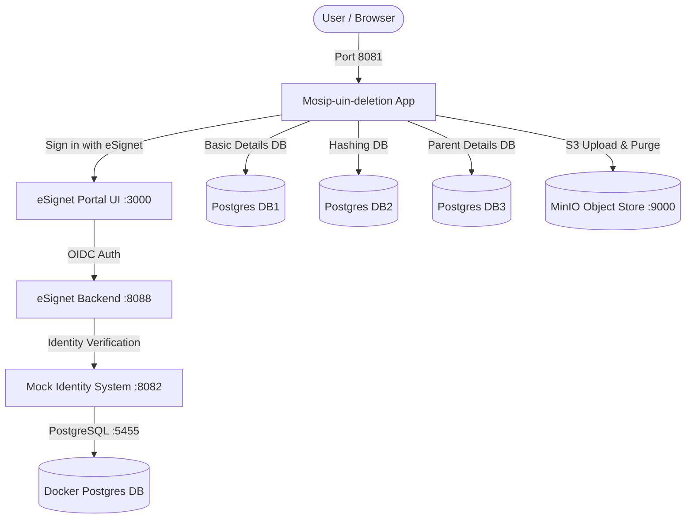

# Project Structure & Functionality Documentation

This document provides a comprehensive overview of the **MOSIP UIN Registration & Voluntary Deletion Portal** codebase. It details the hierarchical directory structure, describes the purpose and functionality of every source file, lists all configuration parameters, and maps where and how configurations impact the system.

---

## 📂 File Structure Overview

```
Mosip-uin-deletion/
├── .mvn/                                      # Maven wrapper configuration directory
│   └── wrapper/                               # Contains maven-wrapper.properties and jar
├── esignet/                                   # Official MOSIP eSignet Core Submodule & Docker Stack
│   └── docker-compose/                        # Docker Compose deployment & SQL setup scripts
│       ├── docker-compose.yml                 # Defines database, redis, mock-identity-system, esignet, esignet-ui
│       ├── init.sql                           # Database initialization & client registration seed
│       ├── insert_clients.sql                 # Universal OIDC Client ID seed script
│       └── insert_claims.sql                  # Resident claims & demo OTP seed script
├── src/
│   ├── main/
│   │   ├── java/                              # Application source code
│   │   │   └── com/example/mosip/             # Root package for the project
│   │   │       ├── config/                    # Configuration classes for databases and MinIO
│   │   │       ├── controller/                # Spring MVC Controllers for Thymeleaf views & eSignet callbacks
│   │   │       │   └── api/                   # REST API Controllers (for endpoints, images & bulk operations)
│   │   │       ├── dto/                       # Data Transfer Objects for registration form binding
│   │   │       ├── entity/                    # JPA Entities mapped to PostgreSQL tables
│   │   │       │   ├── basic/                 # Entities for Basic details database & audit logs
│   │   │       │   ├── hashing/               # Entities for Hashing database & salt buckets
│   │   │       │   └── parent/                # Entities for Parent details database
│   │   │       ├── enums/                     # Enumerations for system types and folder boundaries
│   │   │       ├── repository/                # Spring Data JPA Repository interfaces
│   │   │       │   ├── basic/                 # Repositories for Basic details database
│   │   │       │   ├── hashing/               # Repositories for Hashing database
│   │   │       │   └── parent/                # Repositories for Parent details database
│   │   │       ├── service/                   # Core business logic (MockIdentity, MinIO, Salt-Modulo Hashing)
│   │   │       └── MosipUinDeletionApplication.java # Spring Boot main entrypoint
│   │   └── resources/                         # Application resources
│   │       ├── static/                        # Static assets (CSS, branding logos, icons)
│   │       │   └── css/                       # Stylesheets (styles.css)
│   │       ├── templates/                     # Thymeleaf HTML view templates
│   │       └── application.properties         # Central application configurations & eSignet parameters
│   └── test/
│       └── java/                              # Test source code
│           └── com/example/mosip/             # Test classes
│               └── MosipUinDeletionApplicationTests.java # Context loading tests
├── pom.xml                                    # Maven project definition & dependencies configuration
├── mvnw                                       # Maven Wrapper execution script (Unix)
├── mvnw.cmd                                   # Maven Wrapper execution script (Windows)
├── jwk_gen.py                                 # RSA Keypair & JWK generator script for OIDC Relying Party
├── rp_jwk.json                                # Relying Party Public JWK key set
├── .gitignore                                 # Files and folders to ignore in Git
├── .gitattributes                             # Git line endings configuration
├── README.md                                  # Project overview and run instructions
└── structure.md                               # Complete codebase structure & functionality documentation
```

### Purpose of Each Directory

* **`esignet/docker-compose/`**: Contains the Docker Compose stack running the 5 official MOSIP infrastructure services (`database` on port 5455, `redis` on port 6379, `mock-identity-system` on port 8082, `esignet` backend API on port 8088, and `esignet-ui` OIDC Portal on port 3000). Also includes SQL scripts for pre-registering Client IDs and demo claims.
* **`src/main/java/com/example/mosip/config/`**: Sets up Spring configurations, managing multi-database architecture (three distinct PostgreSQL datasources) and initializing the MinIO S3-compatible client.
* **`src/main/java/com/example/mosip/controller/`**: Orchestrates web requests. Contains controllers serving Thymeleaf templates for forms, official **eSignet Authentication** callbacks (`/delete/callback`), multi-step deletion, success screens, and audit logs.
* **`src/main/java/com/example/mosip/controller/api/`**: Exposes REST endpoints to allow integration, bulk onboarding, programmatic deletion of residents' data, and dedicated image deletion operations (`/api/images`).
* **`src/main/java/com/example/mosip/dto/`**: Holds DTOs (Data Transfer Objects) that bind incoming registration web form submissions containing multipart file data (profile images, identity cards) and text fields.
* **`src/main/java/com/example/mosip/entity/`**: Segmented by database concern (basic, hashing, parent). Holds entities annotated with JPA annotations mapping to tables across PostgreSQL instances.
* **`src/main/java/com/example/mosip/enums/`**: Defines system enums, specifically `ImageType` mapping image categories to folder structures (`/profile-pictures/`, `/aadhar-cards/`, `/documents/`) and file size boundaries.
* **`src/main/java/com/example/mosip/repository/`**: Holds JPA repository interfaces facilitating CRUD operations across the three database boundaries.
* **`src/main/java/com/example/mosip/service/`**: Houses utility and storage services, specifically for eSignet mock identity integration, executing MOSIP-style salt-modulo hashing, and managing MinIO multi-image storage.
* **`src/main/resources/static/`**: Houses static public assets (CSS stylesheets, MOSIP logos, icons).
* **`src/main/resources/templates/`**: Holds HTML templates processed by Thymeleaf to dynamically render responsive user interfaces.

---

## 🧩 File Functionality

Below is a detailed guide on what each file does and the role of each component in the application.

### Build and Infrastructure Files
* **[pom.xml](file:///c:/Users/Harsh/Documents/GitHub/Mosip-uin-deletion/pom.xml)**: Defines Maven dependencies including Spring Boot starters (Thymeleaf, Web, Data JPA), PostgreSQL driver, devtools, and the MinIO client SDK (`io.minio:minio`).
* **[MosipUinDeletionApplication.java](file:///c:/Users/Harsh/Documents/GitHub/Mosip-uin-deletion/src/main/java/com/example/mosip/MosipUinDeletionApplication.java)**: The main entrypoint of the application. Annotated with `@SpringBootApplication` to boot up the Spring context and Tomcat web server on port `8081`.
* **[jwk_gen.py](file:///c:/Users/Harsh/Documents/GitHub/Mosip-uin-deletion/jwk_gen.py)**: Generates 2048-bit RSA keypairs and encodes them into JWK (JSON Web Key) format for standard OIDC Relying Party signature verification.
* **[esignet/docker-compose/docker-compose.yml](file:///c:/Users/Harsh/Documents/GitHub/Mosip-uin-deletion/esignet/docker-compose/docker-compose.yml)**: Defines and links 5 Docker containers:
  * `database` (PostgreSQL 15 on port `5455`)
  * `redis` (Redis 6 on port `6379`)
  * `mock-identity-system` (Mock Resident DB & OTP engine on port `8082`)
  * `esignet` (OIDC Core REST service on port `8088`)
  * `esignet-ui` (NGINX OIDC User Portal on port `3000`)
* **[esignet/docker-compose/init.sql](file:///c:/Users/Harsh/Documents/GitHub/Mosip-uin-deletion/esignet/docker-compose/init.sql)**: Initializes PostgreSQL schemas `mosip_esignet` and `mosip_mockidentitysystem`, seeding pre-registered Relying Party credentials (`_UgkpFCOsqoxsbLfywjXFuVRYZaHeYK6l0GmxMg3Rg8`).

---

### Configuration Classes (`/config`)
* **[BasicDbConfig.java](file:///c:/Users/Harsh/Documents/GitHub/Mosip-uin-deletion/src/main/java/com/example/mosip/config/BasicDbConfig.java)**:
  * Manages Database 1 (Demographics & Audit details).
  * Defines the primary `DataSource` bean (`basicDataSource`) bound to prefix `spring.datasource.basic`.
  * Configures the Primary Entity Manager (`basicEntityManagerFactory`) and Transaction Manager (`basicTransactionManager`).
* **[HashingDbConfig.java](file:///c:/Users/Harsh/Documents/GitHub/Mosip-uin-deletion/src/main/java/com/example/mosip/config/HashingDbConfig.java)**:
  * Manages Database 2 (UIN cryptographic hashes & salt values).
  * Defines `hashingDataSource` bound to prefix `spring.datasource.hashing`.
  * Configures `hashingEntityManagerFactory` and `hashingTransactionManager`.
* **[ParentDbConfig.java](file:///c:/Users/Harsh/Documents/GitHub/Mosip-uin-deletion/src/main/java/com/example/mosip/config/ParentDbConfig.java)**:
  * Manages Database 3 (Father/Mother details).
  * Defines `parentDataSource` bound to prefix `spring.datasource.parent`.
  * Configures `parentEntityManagerFactory` and `parentTransactionManager`.
* **[MinioConfig.java](file:///c:/Users/Harsh/Documents/GitHub/Mosip-uin-deletion/src/main/java/com/example/mosip/config/MinioConfig.java)**:
  * Reads MinIO endpoint credentials from properties.
  * Registers a singleton `MinioClient` bean to connect to the local/remote S3 object storage server on port `9000`.

---

### Services (`/service`)
* **[MockIdentityService.java](file:///c:/Users/Harsh/Documents/GitHub/Mosip-uin-deletion/src/main/java/com/example/mosip/service/MockIdentityService.java)**:
  * Manages integration with MOSIP's Mock Identity System on port `8082`.
  * Implements `createIdentity(registration)`: converts DTOs to MOSIP Identity JSON syntax.
  * Implements **Direct PostgreSQL Database Fallback** (`localhost:5455`, `mosip_mockidentitysystem.mock_identity`) to insert and fetch resident identity records directly when REST endpoints are unreachable.
  * Facilitates demo OTP verification (`111111` / `00000`) for resident authentication.
* **[SaltModuloHashService.java](file:///c:/Users/Harsh/Documents/GitHub/Mosip-uin-deletion/src/main/java/com/example/mosip/service/SaltModuloHashService.java)**:
  * Implements MOSIP-style deterministic salt-modulo hashing.
  * Seeds 1000 random salt buckets into Database 2 (`uin_hash_salt` table) on startup if missing.
  * Computes deterministic cryptographic hashes: `SHA-256(id + salt[id mod modulo])`.
* **[MinioStorageService.java](file:///c:/Users/Harsh/Documents/GitHub/Mosip-uin-deletion/src/main/java/com/example/mosip/service/MinioStorageService.java)**:
  * Manages MinIO operations for profile photos and identity documents.
  * Automatically creates the target bucket (`mosip-uin-deletion-bucket`) on startup if missing.
  * Validates file size limits per `ImageType` and checks allowed file format extensions (JPG, PNG, WEBP, PDF).
  * Uploads images into organized folder structures: `profile-pictures/{userId}-{UUID}.ext`, `aadhar-cards/...`, `documents/...`.
  * Generates temporary presigned URLs (`expiry=604800s`) for secure preview.
  * Implements `deleteImage(...)`, `deleteImageByObjectKey(...)`, and `deleteAllUserImages(userId)`, purging files across all folders and returning deleted MinIO object paths for audit logging.

---

### Controllers (`/controller`)
* **[RegistrationController.java](file:///c:/Users/Harsh/Documents/GitHub/Mosip-uin-deletion/src/main/java/com/example/mosip/controller/RegistrationController.java)**:
  * Renders HTML views for home (`/`) and registration form (`/register`).
  * Processes registrations: generates random unique User IDs (`USR-XXXXXXXX`) and 10-digit UINs.
  * Uploads resident profile pictures directly to MinIO storage bucket (`profile-pictures/`) via `MinioStorageService`.
  * Saves resident identity into Mock Identity System DB and creates records across demographic and hash tables.
* **[DeletionController.java](file:///c:/Users/Harsh/Documents/GitHub/Mosip-uin-deletion/src/main/java/com/example/mosip/controller/DeletionController.java)**:
  * Controls official eSignet OIDC integration and voluntary deletion flow.
  * **`GET /delete`**: Renders voluntary deletion portal with official **Sign in with eSignet** button.
  * **`GET /delete/callback` & `/userprofile`**: Handles eSignet OIDC redirect callback. Resolves authenticated resident UIN (`1234567890`), executes `populateFullIdentityModel(...)`, and populates demographic, address, contact, and parent details into `confirm-delete.html`.
  * **`POST /delete/confirm`**: Executes sequential deletion:
    1. Demographics (`UserBasicDetails` in Database 1)
    2. Parent details (`UserParentDetails` in Database 3)
    3. MinIO Multi-Image Store (`MinioStorageService.deleteAllUserImages`)
    4. Cryptographic UIN hash (`UserUinHash` in Database 2)
  * Writes execution logs and deleted MinIO filepaths to `DeletionAudit` (`audit.detail`), removing `UserDataLocation` registry on success.
  * **`GET /audit-logs`**: Queries `DeletionAudit` table, calculates dashboard statistics, and supports filtering by User ID.
* **[api/RegistrationApiController.java](file:///c:/Users/Harsh/Documents/GitHub/Mosip-uin-deletion/src/main/java/com/example/mosip/controller/api/RegistrationApiController.java)**:
  * Exposes programmatic HTTP endpoints `POST /api/register` and `POST /api/register/bulk`.
* **[api/DeletionApiController.java](file:///c:/Users/Harsh/Documents/GitHub/Mosip-uin-deletion/src/main/java/com/example/mosip/controller/api/DeletionApiController.java)**:
  * Exposes programmatic HTTP endpoint `DELETE /api/user/{userId}` for cascading purges.
* **[api/ImageDeletionApiController.java](file:///c:/Users/Harsh/Documents/GitHub/Mosip-uin-deletion/src/main/java/com/example/mosip/controller/api/ImageDeletionApiController.java)**:
  * Dedicated REST API controller for image management under `/api/images`.

---

### View Templates (`/resources/templates`)
* **[home.html](file:///c:/Users/Harsh/Documents/GitHub/Mosip-uin-deletion/src/main/resources/templates/home.html)**: Main landing screen with quick navigation to register or delete UIN.
* **[register.html](file:///c:/Users/Harsh/Documents/GitHub/Mosip-uin-deletion/src/main/resources/templates/register.html)**: Registration form with demographic fields, parent details, and live JS file upload dropzones.
* **[success.html](file:///c:/Users/Harsh/Documents/GitHub/Mosip-uin-deletion/src/main/resources/templates/success.html)**: Registration success page displaying generated credentials and image previews via presigned MinIO URLs.
* **[delete.html](file:///c:/Users/Harsh/Documents/GitHub/Mosip-uin-deletion/src/main/resources/templates/delete.html)**: Voluntary deletion landing page featuring official **Sign in with eSignet** authentication button.
* **[verify-otp.html](file:///c:/Users/Harsh/Documents/GitHub/Mosip-uin-deletion/src/main/resources/templates/verify-otp.html)**: Fallback OTP verification page for demo OTP `00000`.
* **[confirm-delete.html](file:///c:/Users/Harsh/Documents/GitHub/Mosip-uin-deletion/src/main/resources/templates/confirm-delete.html)**: Multi-section profile review card presenting verified demographic, address, contact, and parent details before deletion.
* **[delete-success.html](file:///c:/Users/Harsh/Documents/GitHub/Mosip-uin-deletion/src/main/resources/templates/delete-success.html)**: Final deletion summary displaying layer-by-layer status and purged MinIO file paths.
* **[audit-logs.html](file:///c:/Users/Harsh/Documents/GitHub/Mosip-uin-deletion/src/main/resources/templates/audit-logs.html)**: Audit dashboard with success statistics, detailed table logs, and search filters.

---

## ⚙️ Configuration Parameters (`application.properties`)

Stored in: **`src/main/resources/application.properties`**

| Property Name | Purpose | Value |
|---|---|---|
| `server.port` | Application execution port | `8081` |
| `spring.application.name` | Spring Application Identifier | `mosip-uin-deletion` |
| `mosip.esignet.host` | Local eSignet Portal Host | `http://localhost:3000` |
| `mosip.esignet.authorize-url` | eSignet OIDC Authorize Endpoint | `http://localhost:3000/authorize` |
| `mosip.esignet.client-id` | Universal Registered Relying Party Client ID | `_UgkpFCOsqoxsbLfywjXFuVRYZaHeYK6l0GmxMg3Rg8` |
| `mosip.esignet.redirect-uri` | Relying Party Redirect Callback | `http://localhost:8081/delete/callback` |
| `mockidentity.db.url` | Docker PostgreSQL Mock Identity DB URL | `jdbc:postgresql://localhost:5455/mosip_mockidentitysystem` |
| `mockidentity.db.username` | Mock Identity DB User | `postgres` |
| `mockidentity.db.password` | Mock Identity DB Password | `postgres` |
| `minio.endpoint` | MinIO S3 API Endpoint | `http://127.0.0.1:9000` |
| `minio.access-key` | MinIO Access Key | `minioadmin` |
| `minio.secret-key` | MinIO Secret Key | `minioadmin` |
| `minio.bucket` | Target MinIO Bucket | `mosip-uin-deletion-bucket` |
| `mosip.ida.salt.modulo` | Salt bucket count for modulo hashing | `1000` |

---

## 🔗 Architecture Diagram


```mermaid
flowchart TD
    User([User / Browser]) -->|Port 8081| RP[Mosip-uin-deletion App]
    RP -->|Sign in with eSignet| eSignetUI[eSignet Portal UI :3000]
    eSignetUI -->|OIDC Auth| eSignetBackend[eSignet Backend :8088]
    eSignetBackend -->|Identity Verification| MockIDSystem[Mock Identity System :8082]
    MockIDSystem -->|PostgreSQL :5455| PostgresDocker[(Docker Postgres DB)]

    RP -->|Basic Details DB| DB1[(Postgres DB1)]
    RP -->|Hashing DB| DB2[(Postgres DB2)]
    RP -->|Parent Details DB| DB3[(Postgres DB3)]
    RP -->|S3 Upload & Purge| MinIO[(MinIO Object Store :9000)]
```
